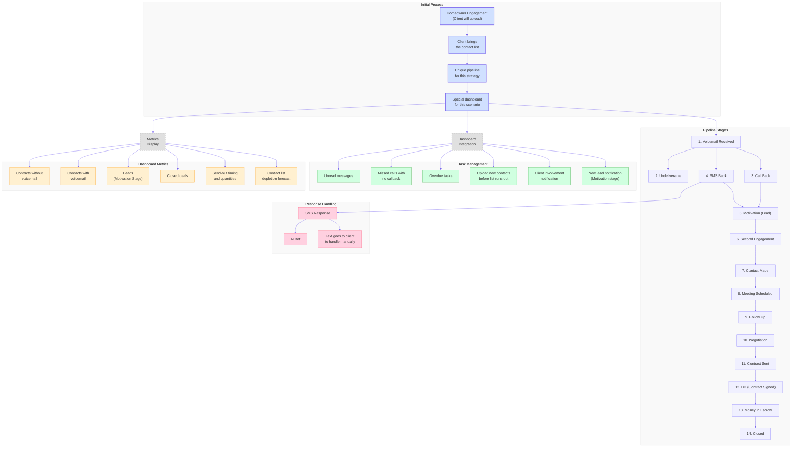
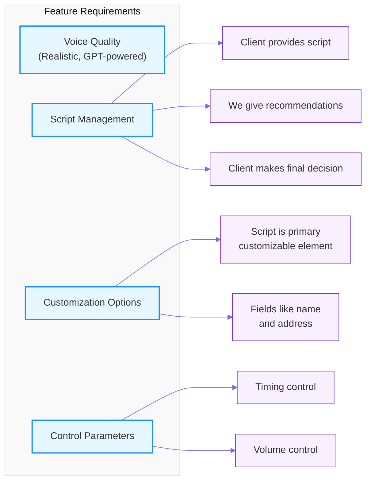

# Distressed Homeowners Pipeline - Mermaid Diagram

This file contains a modern, interactive diagram of the Distressed Homeowners Pipeline workflow using mermaid syntax.

## Flow Diagram

## Feature Requirements Diagram

## Usage Instructions

To view these diagrams:
1. Use a markdown viewer that supports mermaid syntax (like GitHub, GitLab, or VS Code with the appropriate extension)
2. The diagrams will render automatically in supported environments
3. For static viewing, you can paste the mermaid code into the [Mermaid Live Editor](https://mermaid-js.github.io/mermaid-live-editor/) to generate an image

## Implementation Notes

- The purple diamonds in the original flowchart are represented as nodes with different colors and styles
- The flow maintains the same logical progression as the original diagram
- Stage automation is not visually distinguished in this diagram but is noted in the documentation 